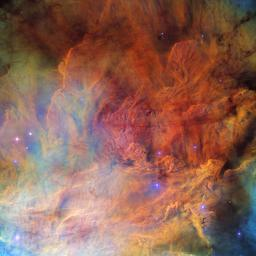

# Astronomical Super-Resolution

  
  

## Table of contents

- [SRCNN-PyTorch](##Background)
- [Dataset](##Dataset)
- [System](##System)
    - [System Architecture](#SystemArchitecture)
- 

## Background

The goal of this project is to enhance low-resolution astronomical images using a Convolutional Neural Network (CNN) designed for super-resolution. Given the high computational cost and large dataset typically required to train such a model from scratch, I applied transfer learning on a smaller dataset, allowing for shorter training times while still achieving effective results.

## Dataset

Finding a suitable dataset of astronomical images was more challenging than anticipated. Ultimately, I used images from the European Space Agency (ESA) archives. The dataset preparation involved several steps:

1. **Data Download**: The images were downloaded using a script located at `data/image_downloader.py`.
2. **Image Filtering**: Many images in the ESA archive were either illustrations or computer-generated. These images were manually sorted to exclude non-astronomical visuals.
3. **Image Preprocessing**:
   - All images were resized to a uniform resolution of **256x256 pixels** to serve as the ground truth for the model’s output.
   - Each image was then downscaled to **128x128 pixels** to generate the input images for the model.

   The preprocessing steps are saved in `data/image_preprocess.py`.

Due to GitHub’s size restrictions, the final dataset is hosted externally. You can access it here: [Google Drive Link](https://drive.google.com/drive/folders/1o1gHGsB3rfzVlgF-8NLJUdxz0WzPK0zq?usp=sharing).

## System

I used a pre-trained Super-Resolution CNN from [this repository](https://github.com/Lornatang/SRCNN-PyTorch?tab=readme-ov-file). The original model was modified to include an initial bicubic interpolation layer to upscale the input image, as the original model required the input and output to have the same dimensions. it is important to note that this system processes each image channel (RGB) independently.

### System Architecture

The system starts with a bicubic interpolation layer that upsamples the input image from `(batch_size, 1, H, W)` to `(batch_size, 1, 2H, 2W)`. After this layer, the model includes three convolutional layers:

1. **Feature Extraction Layer**: 
   - Input size: `(batch_size, 1, 2H, 2W)`
   - Output size: `(batch_size, 64, 2H, 2W)`
   - This layer is followed by a ReLU activation function.

2. **Non-Linear Mapping Layer**: 
   - Input size: `(batch_size, 64, 2H, 2W)`
   - Output size: `(batch_size, 32, 2H, 2W)`

3. **Reconstruction Layer**: 
   - Input size: `(batch_size, 32, 2H, 2W)`
   - Output size: `(batch_size, 1, 2H, 2W)`

This architecture allows the model to upsample and enhance each color channel individually, resulting in a higher-resolution output for each input channel.

